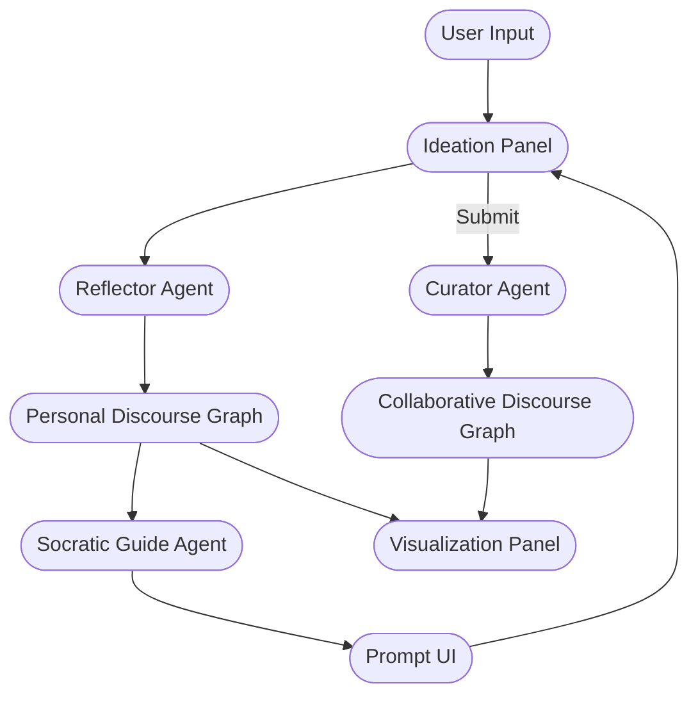

# Guided Sensemaking

We introduce Guided Sensemaking, an AI-augmented multiagent discourse platform that facilitates composition of well-thought-out ideas around a central question, provides scaffolding for critical thinking, and enables visualization of argumentative structure to support critical thinking and collaborative deliberation.

The system uses several interactive agents to provide context-sensitive questioning prompts and a scaffolding for thought that exposes thematic clusters, agreements, and points of contention without collapsing diverse perspectives.

## Interaction Design

Users interact with Guided Sensemaking through a split interface consisting of an ideation panel and a dynamic visualization.

The interaction begins when an organizer (e.g., an instructor or facilitator) posts a prompt that frames the overarching topic or problem space. Participants respond by repeatedly making claims and developing arguments supported by reasoning, examples, and narratives. Ideation occurs in an iterative manner, where each revision of the write-up causes a Reflector agent to parse the text to extract key claims, assumptions, and supporting elements to update a personal discourse graph. This visualization allows participants to visually track how their ideas evolve over time.

The Socratic Guide can also suggest relevant evidence such as scientific publications to aid the research process. Participants may respond to these Socratic prompts by revising their text, adding clarifications, or incorporating new sources. However, since this is not a chat-style interface, users cannot directly respond to the Socratic Guide.

Once satisfied, participants submit their write-up to the collective discourse. The Curator agent integrates their contributions into a collaborative graph that represents the structure of the ongoing conversation.

## Architecture

The diagram illustrates the core communication flow between the user, editor, agents, and visualization panels described in the README and AGENTS.md files. The flow is intentionally simplified to emphasize the key interactions:

> 1. **Text → Reflector**: extracts claims, assumptions, evidence into a personal graph.
> 2. **Personal Graph → Socratic Guide**: generates non‑chat prompts.
> 3. **Personal Graph → Curator** (on submit): merges into a global collaborative graph.
> 4. **Both graphs → Viewer**: provides dynamic visual feedback to the user.

## Interaction Flow

1. **User Input** – A participant opens the ideation panel and writes/edits a passage. The text stream (or final revision) is sent to the **Reflector Agent**.

2. **Reflection** – The Reflector parses the text, identifies **claims**, **assumptions**, and **evidence**, and emits a *personal discourse graph* (nodes + edges). This graph is stored in a per‑user session store.

3. **Socratic Prompting** – Periodically (or on request), the **Socratic Guide** consumes the user’s personal graph and the user’s intent metadata (prompt topic, question hierarchy). It applies semantic matching against a knowledge base of sources and generates context‑sensitive non‑chat prompts such as:
   * "Consider citing recent research on argumentation theory to support Claim #3."
   * "Your evidence for Assumption #2 may not be robust; can you supply a statistic?"
   These prompts are displayed in the UI near the editor.

4. **User Refines** – The participant edits their text in response to the Socratic prompts. The revised text is re‑submitted to the **Reflector**, which updates the personal graph.

5. **Submission** – When the participant clicks *Submit*, the personal graph is forwarded to the **Curator**.

6. **Curating** – The Curator takes **all** personal graphs in the discussion room, performs duplicate detection and redundancy pruning, and merges them into the **Collaborative Discourse Graph**. It also tags edges with provenance (which user contributed them) and manages conflict resolution (e.g. contradictory claims). The resulting graph becomes the source of truth for downstream analytics and visualization.

7. **Visualization & Navigation** – The frontend consumes the collaborative graph and renders it via a graph library (React‑Flow/D3). Users can inspect claim provenance, evidence chains, and contradictions visually.

8. **Feedback Loop** – The system may periodically re‑invoke **Socratic Guide** on the updated collaborative graph to surface macro‑level gaps (e.g., missing evidence for a key claim) and present them to the organizer.

## Communication Protocols

- **Message Bus**: The platform uses Redis Pub/Sub as a lightweight event bus for intra‑service communication.
- **Graph Serialization**: All graphs are transmitted in a compact JSON‑LD or GraphQL schema that encodes node types, labels, and edge relations.
- **Agent APIs**: Each agent communicates with the api-gateway through Redis. The api-gateway exposes REST endpoints for user interactions.

Internal orchestration is handled by the **Architect**.

This orchestrated flow ensures that the system scales, remains modular, and allows each agent to evolve independently while maintaining a clear contract with its peers.
